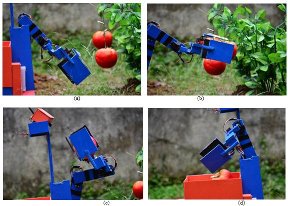
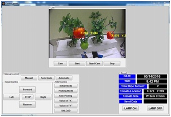
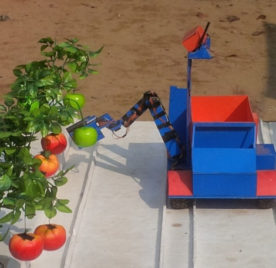
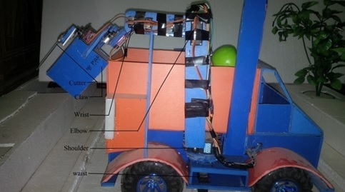
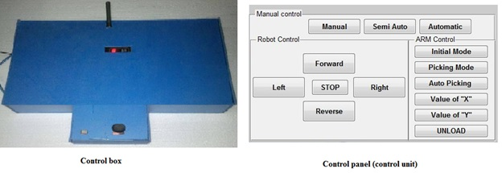
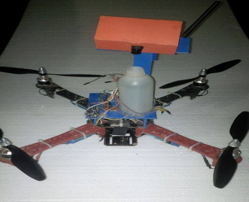
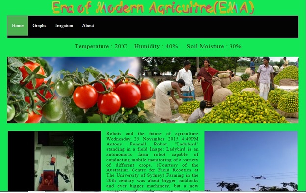

# Undergrad Project – Agro Robot
The main goal of our project is to increase the productivity of crops by using a robotic system. Bangladesh is far behind from modern agricultural system. Traditional agricultural
the system suffers from labor problems, labor cost, productivity problems, etc. A robot can
work all day long continuously without any fatigue. So labor problem and its associated
costs can be greatly reduced by introducing the robotic system in organic agriculture. Besides, an agricultural field can always be kept under observation using a robotic system, thus resulting in proper irrigation, insecticide spraying, weeding, watering, etc.   Considering these points, we have developed an autonomous robotic system that can monitor, control, and function intelligently under different circumstances. The system can be subcategorized
into three parts fruit picker, field manager, and sky doctor. The fruit picker can identify ripe tomatoes, cut them off the tree and then store them into its internal storage. The field manager inspects soil moisture and provides auto-irrigation, whereas the sky doctor sprays insecticide over the field when needed. A control panel at a remote distance always keeps contact with the field robots. The Control panel also communicates with a dedicated server that keeps agricultural information and passes the server information to the field robot to make a better decision. Though the initial installation cost may rise up to 60,150 BDT, the system requires a very low maintenance cost and can be used for several years. So, the proposed system is not only efficient but also cost-effective.

Fore more detail, click [here](https://www.lus.ac.bd/news/%e0%a6%85%e0%a7%8d%e0%a6%af%e0%a6%be%e0%a6%97%e0%a7%8d%e0%a6%b0%e0%a7%8b-%e0%a6%b0%e0%a7%8b%e0%a6%ac%e0%a6%9f%e0%a6%bf%e0%a6%95-%e0%a6%b8%e0%a6%bf%e0%a6%b7%e0%a7%8d%e0%a6%9f%e0%a7%87%e0%a6%ae/).

#### Video
<iframe width="560" height="315" src="https://www.youtube.com/embed/odYYKPlxI6A" title="YouTube video player" frameborder="0" allow="accelerometer; autoplay; clipboard-write; encrypted-media; gyroscope; picture-in-picture" allowfullscreen></iframe>   
<iframe width="560" height="315" src="https://www.youtube.com/embed/Wrg9cnF9nDo" title="YouTube video player" frameborder="0" allow="accelerometer; autoplay; clipboard-write; encrypted-media; gyroscope; picture-in-picture" allowfullscreen></iframe>

#### Images

## Description

### Implementation Summary
* Fruit-picker robot: Implemented using Arduino Mega and Arduino Nano microcontroller board.
* Video processing: Implemented using FPV camera and MATLAB.
* Field manager: Implemented using quad-copter, temperature sensor, and humidity sensor.
* Server: Implemented using XAMPP.

### Components list:

*	FPV CAMERA – 1 pc
*	FPV TX-RX(5.8Ghz 200mW Wireless AV TX+RX Combo TS351+RC305) – 1 pair
*	AV TO USB CONVERTER	(Easy Cap 2.0) – 1 pc
*	RADIO COMMUNICATION MODULE (Nrf-24l01 transceiver) – 7 pc
*	ARDUINO MEGA (MEGA-2560) – 2 pc
*	ARDUINO NANO (Nano V3.0 (Atmel 328P)) – 3 pc
*	DC MOTOR (12V, 200 RPM) – 4 pc
*	WHEEL – 4 pc
*	SERVO (MG90-S	, 2.5kg torque digital servo) – 4 pc
*	SERVO (MG995,	10kg torque digital servo) – 2 pc
*	SERVO (MG996,	13kg torque digital servo) – 1 pc
*	SERVO (S8203, 33kg high toque digital servo) – 1 pc
*	TEMPARATURE & HUMITIDY SENSOR (HSM-20G Humidity sensor module) – 1 pc
*	BLDC MOTOR (EMAX 820KV) – 4 pc
*	ESC (30A ESC) – 4 pc
*	PROPELLER (10 x 4.5) – 2 set
*	QUAD FRAME – 1 pc
*	RADIO CONTROLLER (5-chennel) – 1 pc
*	SOIL MOISTER SENSOR	(FC-28-C) – 1 pc
*	WATER PUMP (12V pump) – 2 pc
*	RELAY (6V) – 3 pc
*	FLIGHT CONTROLLER (Openpilot CC3D) – 1 pc
*	BATTERY (Lipo 1800mAh, 11.1V) – 2 pc

### Fruit-picker

Autonomous fruit picker is a robot that can pick fruits automatically. This robot has a container by which it carries the picking fruit. 

#### Construction details of the Fruit-picker
Fruit picker is a one kind of autonomous robot. We have made this robot by 5 mm polyvinyl chloride (PVC) sheet. This robot length is 18 inch and width is 14 inch. It is driven by 4 high torque dc motor. The speed of those motors is 200 rpm. Those  motors can carry maximum 2kg load. Each motor is attached with a individual wheel of 5 inch diameter. The distance between two wheels is 6 inch. The clearance between robot base to ground is 2.5 inch. A circuitry box is set up above the base which length & width are respectively 18 inch & 8 inch. We have installed power supply, communication module & processing unit into the circuitry box. This circuitry box controls all the parts of robot by its power supply. We have made a fruit container beyond the circuitry box. We have made this container keeping on mind that when robot picks the fruit, it can store them into the fruit container. This robot bear a robotics hand that is used by the robot for picking the fruit. This hand is made by 10 mm polyvinyl chloride (PVC) sheet. Height of the hand is 24 inch. The hand is consisted of 6 servo motor. This robotic hand has waist, shoulder, elbow, wrist and claw. Waist is measured by the length of 2.5 inch, width of 4.5 inch & height of 1.8 inch. Waist is consisted of MG995 servo with 6202ZZ bearing. We have set up the shoulder beyond this bearing of waist. The distance between the shoulder & the elbow is 10 inch. Elbow is consisted of MG996 servo motor. Distance between the elbow & wrist is consisted of MG995 servo motor. For picking the fruit the name of the hand is claw which height is 3 inch. This claw is operated by MG905 servo motor. For cutting the peduncle of the fruit a cutter is attached with the claw. This cutter is moved by MG905 servo motor. There is a camera stand beside the waist of the hand.10 mm polyvinyl chloride (PVC) sheet is used to make the camera stand. Height of the camera stand is 12 inch & width is 2 inch. It carries a camera with a video transmitter.

#### Mechanism

Fruit picker is designed for a specific fruit. At this moment, this robot can recognize only tomato through its color detection method. When the robot is reached at operation mode then it tries to communicate with control panel by 2.4 GHz radio link with a fixed address. If the control panel’s address matches with the fixed address of the robot then the radio link builds a communication between the robot & control panel. Control panel has a control box & a laptop. This laptop has a software by which it can communicate with robot as well as the control box can communicate with the robot. At the time of manual operation the operator can operate the robot using a joystick of the control box or using the software of the laptop. When the operator selects the autonomous mode, the robot enters the picking mode. In autonomous mode, the robot sends a video signal to control panel which is received by a video receiver. A converter is located into the control panel which converts the video signal into digital video input signal. This converted signal is send to the software of the laptop. The resolution of the video input signal is 720/480 PX. After that the software analysis the video signal through color detection method. In video analysis if it finds any rip tomato which color is red then it calculates the fruit’s position & after that it finds the fruit’s exact location. Then the software sends the location of the fruit to the robot. Just after the robot moves towards the fruit location. When the robot is reached in front of the fruit then the robot hold the fruit by its arm, cuts the peduncle of the fruit, pick it & finally drop it to the fruit container. For completing this fruit picking process, the robot takes approximately 30 sec. The overall process will be repeated continuously after 30 sec. When the fruit container is fully loaded with fruit, if the operator wants he can unload the fruit to the container.

### Sky doctor

Sky doctor is a system which sprays insecticide over the crops by using a flying vehicle. Flying vehicle can be RC quad copter, helicopter, aircraft etc.

#### Construction
We have chosen quad copter as a flying vehicle for sky doctor. For this quad copter 820KV BLDC motor has been used. Each motor has 830gm trust. 30amp ESC is used for each motor. We have used propeller which rating is 10x45. For controlling the quad copter we have used open pilot CC3D flight controller & 5-channel radio controller. To set up the entire spraying system, we have made a basement into middle of the quad frame which both length & width is 5 inch. And height from the quad base is 2 inch. A 250 ml insecticide tank with a spraying pump is set up over the base. A camera stand is placed behind the insecticide tank which width & height are respectively 1 inch & 7 inch. This camera stand carries a video camera with a transmitter. 

### Server-based field manager
A field manager is an auto-irrigation system that is controlled by a control panel depending on the environmental situation.

The following figure shows the server layout - 

At starting, the control panel receives the experimental data from the field and store these data in its database. After that, the control panel matches the environmental data with its database. If it is matched, then the control panel solves an equation. This equation is (temperature + Humidity)x(100-Soil Moisture). After solving this equation the control panel sends the result to the field. After receiving the result the auto-irrigation system will be started or stopped. But if it is not matched, then the control panel sends the environmental data to the server directly. Server analyses these data and matches the data with its own database. If the environmental data is matched with its data, then it sends its decision to the field through the control panel. If it does not match, then the server will not send any decision to the field.  

