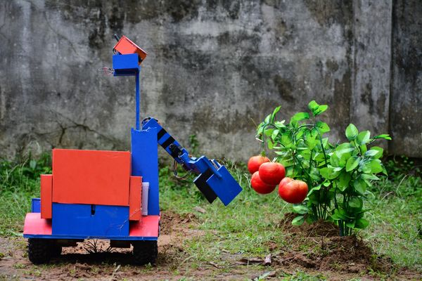

## Undergrad Project – Agro Robot
The main goal of our project is to increase the productivity of crops by using a robotic system. Bangladesh is far behind from modern agricultural system. Traditional agricultural
the system suffers from labor problems, labor cost, productivity problems, etc. A robot can
work all day long continuously without any fatigue. So labor problem and its associated
costs can be greatly reduced by introducing the robotic system in organic agriculture. Besides, an agricultural field can always be kept under observation using a robotic system, thus resulting in proper irrigation, insecticide spraying, weeding, watering, etc.   Considering these points, we have developed an autonomous robotic system that can monitor, control, and function intelligently under different circumstances. The system can be subcategorized
into three parts fruit picker, field manager, and sky doctor. The fruit picker can identify ripe tomatoes, cut them off the tree and then store them into its internal storage. The field manager inspects soil moisture and provides auto-irrigation, whereas the sky doctor sprays insecticide over the field when needed. A control panel at a remote distance always keeps contact with the field robots. The Control panel also communicates with a dedicated server that keeps agricultural information and passes the server information to the field robot to make a better decision. Though the initial installation cost may rise up to 60,150 BDT, the system requires a very low maintenance cost and can be used for several years. So, the proposed system is not only efficient but also cost-effective.

Fore more detail, click [here](https://www.lus.ac.bd/news/%e0%a6%85%e0%a7%8d%e0%a6%af%e0%a6%be%e0%a6%97%e0%a7%8d%e0%a6%b0%e0%a7%8b-%e0%a6%b0%e0%a7%8b%e0%a6%ac%e0%a6%9f%e0%a6%bf%e0%a6%95-%e0%a6%b8%e0%a6%bf%e0%a6%b7%e0%a7%8d%e0%a6%9f%e0%a7%87%e0%a6%ae/).

#### Video
<iframe width="560" height="315" src="https://www.youtube.com/embed/odYYKPlxI6A" title="YouTube video player" frameborder="0" allow="accelerometer; autoplay; clipboard-write; encrypted-media; gyroscope; picture-in-picture" allowfullscreen></iframe>   
<iframe width="560" height="315" src="https://www.youtube.com/embed/Wrg9cnF9nDo" title="YouTube video player" frameborder="0" allow="accelerometer; autoplay; clipboard-write; encrypted-media; gyroscope; picture-in-picture" allowfullscreen></iframe>

#### Images

